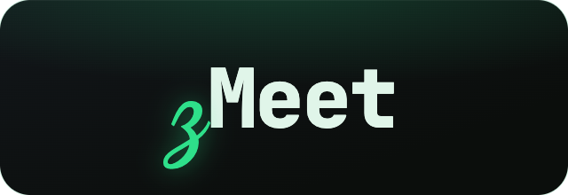

<p align="center">
  
</p>

<p align="center">
  <strong>Private, on-device meeting notes for macOS.</strong><br/>
  Records your meetings and turns them into transcripts and AI summaries — entirely on your Mac.<br/>
  No bot joins your call. Nothing is uploaded.
</p>

<p align="center">
  
  
  
  
</p>

---

## What it is

zMeet is a macOS menu-bar app that records your meetings — both your microphone **and** the
other participants' audio — then transcribes and summarizes them into Markdown notes. The entire
pipeline runs locally: transcription uses Apple's on-device speech recognition, summaries use the
on-device Foundation Models LLM, and the audio never leaves your machine.

Unlike bot-based notetakers, **nothing joins your call** and **nothing is sent to the cloud** — it
captures system audio and your mic directly through macOS, the same way Granola or Jamie do.

---

## How it works

```
Detect meeting  -->  Record  -->  Transcribe  -->  Summarize  -->  Markdown notes
 (Zoom/Teams)       (sys+mic)     (on-device)     (on-device)    (one folder/meeting)
```

1. **Detect** — when a Zoom or Teams meeting starts, a "Take notes" popup offers to record (or start manually from the menu bar).
2. **Record** — captures system audio + microphone, mixed into a single `.m4a`.
3. **Transcribe** — Apple's `SpeechAnalyzer` turns the audio into a transcript, on-device.
4. **Summarize** — Apple's Foundation Models LLM writes a structured summary (Summary / Key Points / Action Items / Decisions).
5. **Save** — everything lands in one folder per meeting under `~/Documents/zMeet`.

---

## Privacy

Privacy is the point, not a feature.

- **Audio never leaves your Mac.** Capture, transcription, and summarization all run locally.
- **No account, no telemetry, no network calls** in the core workflow.
- **No bot in your meeting.** Participants don't see a "zMeet Notetaker" join — capture happens at the OS level.
- **You own the output.** Plain Markdown + an `.m4a`, in a folder you control. Delete a meeting by deleting its folder.

Transcription uses on-device Speech; summaries use on-device Foundation Models (Apple Intelligence).
If Apple Intelligence is off, you still get a full transcript and a basic extractive summary.

Two **opt-in** features step outside the default local-only path, and only when you turn them on:
**cloud summaries** send transcript text + the meeting title (never audio) to the Claude API, and
**Obsidian export** writes Markdown copies into a vault folder on your Mac (local files, no network).

---

## Features

### Capture
- **System audio + microphone**, mixed to a single AAC `.m4a` (ScreenCaptureKit + AVAudioEngine).
- **Captures everyone** — the remote participants (system audio) and you (mic), in one track.
- **Recording modes** — **Remote**, **Hybrid**, and **In-person**, each with its own capture profile (whether to record system audio, mic device, gain) applied automatically when you start.
- **Mic gain** — boost a quiet microphone (e.g. for in-person meetings recorded across a room).
- **Background-noise reduction** (opt-in) — an offline cleanup pass (high-pass + downward expander) for steady noise like fans and hum.
- **Crash-safe** — a recording interrupted by a quit/crash is recovered and finalized on next launch.

### Transcription & notes
- **On-device transcription** via macOS `SpeechAnalyzer` / `SpeechTranscriber`.
- **On-device summaries** via Apple Foundation Models — Summary, Key Points, Action Items, Decisions.
- **Full-meeting summarization** — long meetings are summarized via map-reduce, so the notes cover the whole conversation, not just its opening.
- **Speaker labeling** (opt-in) — tags **You** vs **Others** in remote/hybrid transcripts by recording the mic and system audio as separate tracks.
- **Optional cloud summaries** — point summaries at the Claude API for higher-quality notes (off by default; key stored in the Keychain; falls back to on-device automatically). Audio always stays local; only transcript text + the title are sent.
- **Markdown output** — a readable `notes.md` with YAML frontmatter, plus the full `transcript.md`.
- **Auto-process on stop** (configurable) — stop recording and the notes generate automatically.

### Obsidian export (opt-in)
- **Publish to a vault** — write a linked copy of each processed meeting into an Obsidian vault, turning your notes into a connected "network brain."
- **Linked notes** — each meeting becomes a Markdown note with frontmatter (date, source, duration, mode, attendees) and `[[wikilinks]]` for the people, projects, and topics it surfaced, so the graph connects meetings that share them — plus a companion transcript note.
- **Auto-detected vaults** — your existing Obsidian vaults appear in a dropdown (or pick a folder manually).
- **Backfill** — a "Publish all to vault" button exports every meeting already in your Library into the vault at once (reusing their saved transcripts + notes), so a fresh vault fills with your whole history.
- **Local files, no account** — zMeet writes plain Markdown straight into the vault folder. Idempotent (re-processing overwrites in place) and best-effort (never blocks or fails your notes). Sync the vault yourself (Drive, iCloud, Git, Obsidian Sync) and chat with it via Obsidian's own MCP.

### Meeting detection
- **Zoom & Teams** meeting windows are detected automatically (using the Screen Recording permission already granted for capture).
- **"Take notes" popup** — a floating, non-intrusive prompt offering to record; always asks first, with a close button and 15-second auto-dismiss.

### Menu-bar app
- **Lives in the menu bar** — start/stop, live timer, one-click into the app.
- The menu-bar icon turns into a red mic-in-waveform while recording.

### Library & search
- **Library window** — a conversation-rail view of every past meeting (grouped by date, with real Zoom/Teams icons), a reader with **Notes / Transcript** tabs, and a built-in audio player.
- **Full-text search** across titles, notes, and transcripts (persistent SQLite FTS5 index) — find a meeting by something that was said in it.
- **Right-click** any meeting for its actions (rename, re-process, reveal, delete audio, delete).

### Settings
- A dark, app-styled preferences window: recording modes & mic, audio quality, noise reduction, speaker labeling, meeting detection, cloud summaries, Obsidian export, output folder, permissions, and audio retention.

### Storage management
- **Audio retention** — optionally auto-delete recordings older than a chosen window (7 / 30 / 90 days), or free up space on demand. Transcripts and notes are always kept.

### Output & organization
- **One folder per meeting** under `~/Documents/zMeet`, named by date + title.
- Each folder holds the recording, transcript, and notes together — easy to find, share, or delete.

---

## Requirements

- **macOS 26 or newer** (uses the on-device `SpeechAnalyzer` and Foundation Models frameworks).
- **Apple silicon.**
- **Apple Intelligence enabled** for AI summaries (transcripts work without it).
- A code-signing identity to build and run a signed app (a free Apple ID works for local use).

---

## Install / Build

zMeet builds from source into a signed `.app` bundle.

```sh
# Clone
git clone https://github.com/umzcio/zMeet.git
cd zMeet

# Build + bundle + sign the app
bash scripts/build-app.sh

# Launch
open build/zMeet.app
```

A microphone icon appears in your menu bar. On first recording, grant **Microphone** and
**Screen Recording** permission (Screen Recording is required to capture the other participants'
audio); on first processing, grant **Speech Recognition**.

> The build script signs with a Developer ID by default. Set your own signing identity at the top of
> `scripts/build-app.sh` (or use `security find-identity -p codesigning` to list available ones).

The reusable engine (`ZMeetCore`) is a plain Swift package and is unit-tested:

```sh
swift test
```

---

## How audio capture works

zMeet is a **local-capture** notetaker, not a bot:

- **The other participants** are captured from your Mac's **system audio output** via ScreenCaptureKit.
- **Your voice** is captured from the **microphone** via AVAudioEngine.
- Both are mixed and encoded to one `.m4a`.

Because capture happens at the OS level, muting yourself *inside* Zoom/Teams does **not** stop zMeet
from recording your mic (the app mute only stops transmission, not the OS input). To keep something
off the recording, use the macOS system mic mute (Control Center) — that silences the input device
itself.

---

## Output layout

```
~/Documents/zMeet/
  2026-05-26 1820 Weekly Sync/
    recording.m4a      # mixed system + mic audio
    transcript.md      # full on-device transcript
    notes.md           # AI summary + frontmatter, links to the transcript
  2026-05-27 0930 1:1 with Sam/
    recording.m4a
    transcript.md
    notes.md
```

Internal state (session metadata, logs) lives under `~/.zmeet`.

---

## Architecture

```
  zMeet.app (menu-bar, signed)
  ├─ MenuBarExtra UI ........ start/stop, recent, permissions, "Take notes" popup
  ├─ RecordingController .... drives the capture + processing lifecycle
  ├─ SCKAudioRecorder ....... system audio + mic -> mixed .m4a
  ├─ SpeechTranscription .... on-device SpeechAnalyzer -> transcript
  ├─ MeetingSummarizer ...... on-device Foundation Models -> notes
  └─ MeetingDetector ........ Zoom/Teams window detection
        │
        ▼  depends on
  ZMeetCore (Swift package, unit-tested)
  ├─ SessionManager ......... session lifecycle, processing, crash recovery
  ├─ Models ................. MeetingSession, ZMeetConfig, AudioConfig
  ├─ MeetingRecorder (proto)  the seam the app's recorder implements
  ├─ MarkdownRenderer ....... note + transcript rendering
  └─ ConfigStore ............ ~/.zmeet/config.json
```

The engine (`ZMeetCore`) knows nothing about audio or AI — it defines protocols (`MeetingRecorder`,
and the transcribe/summarize entry points) that the app fills in with the macOS frameworks. That
keeps the engine portable and testable without hardware.

---

## Tech stack

| Layer | Technology |
|-------|-----------|
| **App** | SwiftUI `MenuBarExtra`, Swift 6, AppKit (floating panel) |
| **Engine** | `ZMeetCore` — Swift package (no UI/AV dependencies), Swift Testing |
| **Audio capture** | ScreenCaptureKit (system + mic) + AVAudioEngine (mix) → AAC `.m4a` |
| **Transcription** | Apple `SpeechAnalyzer` / `SpeechTranscriber` (on-device) |
| **Summarization** | Apple Foundation Models (on-device LLM) |
| **Detection** | CoreGraphics window list (Zoom/Teams) |
| **Packaging** | `scripts/build-app.sh` — bundle + `codesign` (hardened runtime) |
| **Storage** | Plain files: `.m4a` + Markdown per meeting; JSON config/state in `~/.zmeet` |

---

## Project structure

```
zMeet/
├── Package.swift
├── Sources/
│   ├── ZMeetCore/          # engine: sessions, models, rendering, config (unit-tested)
│   └── ZMeetApp/           # menu-bar app: recorder, transcription, summary, detection, UI
├── Tests/
│   └── ZMeetCoreTests/     # Swift Testing suite for the engine
└── scripts/
    ├── build-app.sh        # build + bundle + sign zMeet.app
    ├── make-dmg.sh         # package a drag-to-Applications .dmg
    ├── notarize.sh         # notarize + staple (App Store Connect API key)
    ├── release.sh          # build → dmg → notarize → signed Sparkle appcast
    └── assets/             # app icon + bundled wordmark font (OFL)
```

---

## Roadmap

Current release **v1.12.0**. Shipped on top of the v1.0 capture → transcript → notes pipeline:
an in-app Library/Reader window, a Settings UI, full-text search, audio retention/storage
management, right-click actions, recording modes (remote/hybrid/in-person) with per-mode capture
profiles, mic gain, background-noise reduction, You-vs-Others speaker labeling, full-meeting
map-reduce summarization, optional Claude cloud summaries, and Obsidian linked-vault export.

Next: an **Obsidian MCP chat** layer (ask plain-language questions across the vault), a **Notion**
export, and cross-machine **vault sync** options.

---

## License

[MIT](LICENSE) — do what you like; no warranty.
